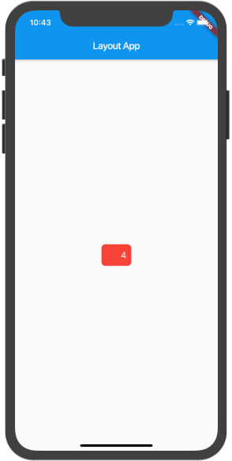

#### Widget

在Flutter中，Widget相当于iOS中的UIView，但并不完全一样。

Widgets拥有不同的生命周期，它们一直存在且保持不变，知道需要改变时才会改变。当它们的状态被改变时，Flutter会构建一颗心的widgets树，而iOS中的views改变时并不会重新创建，只是在使用`setNeedsDisplay()`之后重新绘制。

由于不可变性，Flutter的widgets非常轻量。它们本身并不是什么控件，也不会被直接绘制出什么，而只是UI的描述。

Flutter包含了Material组件库（遵循Material设计规范），MD是一个灵活的设计系统，并且为包括 iOS 在内的所有系统进行了优化。

用Flutter实现任何的设计语言都非常的灵活和富有表现力。在iOS平台，可以使用Cupertino widgets来构建遵循了Apple’s iOS design language的界面。

#### 更新Widget

在Flutter中，widgets是不可变的，而且不能被直接更新，需要去操纵widget的state来更新。StatelessWidget（无状态的Widget）和StatefulWidget（有状态的Widget）就是用来描述这种状态的。当页面构建后不需要改变，就是用StatelessWidget，相反可使用StatefulWidget，例如在发起网络请求后动态更新UI操作。

StatefulWidget与SattelssWidget的区别是，有状态的Widget拥有一个State对象来存储它的状态数据，并且会在Widget重建时携带，不会丢失。

如果一个widget在build之后不会改变，那它就是无状态的。如果一个widget在它的build方法之外改变（运行时由于用户的操作而改变），它就是有状态的。一个有状态的Widget，其父类可以是无状态的，只要父Widget本身不响应这些变化。

StatelessWidget使用示例:

```
void main() {
  runApp(
      Text(
        'Hello world',
        // 排版方向，必须有
        textDirection: TextDirection.ltr,
        style: TextStyle(
          fontWeight: FontWeight.bold,
          fontSize: 100
        ),
      ),
  );
}
```

StatefullWidget使用示例：

```
void main() => runApp(
  dart_widget.SampleApp()
);

class SampleApp extends StatelessWidget {

  @override
  Widget build(BuildContext context) {
    // TODO: implement build
    // 一个应用只有一个MaterialApp，其他页面使用Scaffold
    return MaterialApp(
      title: 'Sample App',
      theme: ThemeData(
      	 // 可以使用primaryColor，但是primarySwatch不可以设置白色
        primarySwatch: Colors.blue,
      ),
      home: SampleAppPage(),
    );
  }
}

class SampleAppPage extends StatefulWidget {
  SampleAppPage({ Key key }) : super(key: key);

  @override
  State<StatefulWidget> createState() {
    // TODO: implement createState
    return _SampleAppPageState();
  }
}

class _SampleAppPageState extends State<SampleAppPage> {
  // 默认占位文字
  String text = 'I like Flutter';
  
  void _updateText() {
    setState(() {
      text = 'Flutter is Awesome!';
    });
  }

  @override
  Widget build(BuildContext context) {
    // TODO: implement build
    return Scaffold(
      appBar: AppBar(
        title: Text('Sample App'),
      ),
      body: Center(
        child: Text(text),
      ),
      floatingActionButton: FloatingActionButton(
        onPressed: _updateText,
        tooltip: 'Update Text',
        child: Icon(Icons.update),
      ),
    );
  }
}

```

MaterialApp是一个方便的Widget，它封装了应用程序实现Material Design所需要的一些Widget。

Scaffold组件是Material Design布局结构的基本实现。此类提供了用于显示drawer、snackbar和底部sheet的API。

#### Widget布局

在Flutter中，通过编写一个widget树来声明布局。

一个带有padding的简单widget：

```
class LayoutSampleApp extends StatelessWidget {
  const LayoutSampleApp({Key key}) : super(key: key);

  @override
  Widget build(BuildContext context) {
    return MaterialApp(
      title: 'Sample App',
      theme: ThemeData(
        primarySwatch: Colors.blue,
      ),
      home: LayoutSampleAppPage(),
    );
  }
}

class LayoutSampleAppPage extends StatefulWidget {
  LayoutSampleAppPage({Key key}) : super(key: key);
  @override
  State<StatefulWidget> createState() {
    // TODO: implement createState
    return _LayoutSampelAppSate();
  }
}

class _LayoutSampelAppSate extends State<LayoutSampleAppPage> {
  var _pressedCount = 0;
  void _updateState() {
    setState(() {
      _pressedCount += 1;
      print(_pressedCount);
    });
  }

  @override
  Widget build(BuildContext context) {
    // TODO: implement build
    return Scaffold(
        appBar: AppBar(
          title: Text('Layout App'),
        ),
        body: Center(
          child: CupertinoButton(
            onPressed: _updateState,
            child: Text(_pressedCount.toString()),
            padding: EdgeInsets.only(left: 40.0, right: 10),
            color: Colors.red,
          ),
        ),
      );
  }
}
```
可以看到如下效果：



#### 添加或移除Widget

在Flutter中，由于Widget不可变，所以没有addSubView()类似的方法，但是可以向parent传入一个返回Widget的函数，并用一个布尔值来控制子Widget的创建。

如下，展示了点击FloatingActionButton时动态切换两个widgets：

```
class SubWidgetSampleApp extends StatelessWidget {
  const SubWidgetSampleApp({Key key}) : super(key: key);

  @override
  Widget build(BuildContext context) {
    return MaterialApp(
      title: 'Sample App',
      theme: ThemeData(
        primarySwatch: Colors.blue
      ),
      home: SubWidgetSampleAppPage(),
    );
  }
}

class SubWidgetSampleAppPage extends StatefulWidget {
  SubWidgetSampleAppPage({Key key}) : super(key: key);

  _SubWidgetSampleAppPageState createState() => _SubWidgetSampleAppPageState();
}

class _SubWidgetSampleAppPageState extends State<SubWidgetSampleAppPage> {

  bool toggle = true;
  void _toggle() {
    setState(() {
      toggle = !toggle;
    });
  }
  // 根据toggle来返回不同的widget
  _getToggleChild() {
    if (toggle) {
      return Text('Toggle One');
    } else {
      return CupertinoButton(
        onPressed: (){},
        child: Text('Toggle Two'),
      );
    }
  }

  @override
  Widget build(BuildContext context) {
    return Scaffold(
        appBar: AppBar(
          title: Text('SubWidget Sample App'),
        ),
        body: Center(
          child: _getToggleChild(),
        ),
        floatingActionButton: FloatingActionButton(
          onPressed: _toggle,
          tooltip: 'Update Text',
          child: Icon(Icons.update),
        ),
    );
  }
}
```

效果请运行[Demo](https://github.com/lingjye/Flutter-Learning/blob/master/helloworld/lib/dart_manage_subwidget.dart){:target="_blank"}查看

#### Widget动画

在Flutter中使用动画库来包裹widgets，而不是创建一个动画Widget。

在Flutter中使用AnimationController（名字是不是有种熟悉的感觉），这是一个可以暂停、寻找、停止、反转动画的Animation<double>类型。他需要一个`Ticker`当vsync发生时来发送信号，并且在每帧运行时创建一个介于0-1之间的线性插值。可以创建一个或多个Animation并附加给一个controller。

例如，用 CurvedAnimation 来实现一个 interpolated 曲线。在这个场景中，controller 是动画过程的“主人”，而 CurvedAnimation 计算曲线，并替代 controller 默认的线性模式。

当构建 widget 树时，你会把 Animation 指定给一个 widget 的动画属性，比如 FadeTransition 的 opacity，并告诉控制器开始动画。

使用 FadeTransition 来让logo 图标渐变显示：

```
class AnimationSampleApp extends StatelessWidget {
  const AnimationSampleApp({Key key}) : super(key: key);

  @override
  Widget build(BuildContext context) {
    return MaterialApp(
      title: 'Fade Demo',
      theme: ThemeData(
        primarySwatch: Colors.blue,
      ),
      home: AnimationSampleAppPage(title: 'Fade Demo'),
    );
  }
}

class AnimationSampleAppPage extends StatefulWidget {
  AnimationSampleAppPage({Key key, this.title}) : super(key: key);

  final String title;

  _AnimationSampleAppPageState createState() => _AnimationSampleAppPageState();
}

class _AnimationSampleAppPageState extends State<AnimationSampleAppPage> with TickerProviderStateMixin{
  AnimationController controller;
  CurvedAnimation curve;
  
  @override
  void initState() {
    // TODO: implement initState
    super.initState();
    controller = AnimationController(
      duration: const Duration(milliseconds: 2000),
      vsync: this
    );
    curve = CurvedAnimation(
      parent: controller,
      curve: Curves.easeIn,
    );
  }

  @override
  Widget build(BuildContext context) {
    return Scaffold(
       appBar: AppBar(
         title: Text(widget.title),
       ),
       body: Center(
         child: Container(
           child: FadeTransition(
             opacity: curve,
             child: FlutterLogo(
               size: 100.0,
             ),
           ),
         ),
       ),
       floatingActionButton: FloatingActionButton(
         tooltip: 'Fade',
         child: Icon(Icons.update),
         onPressed: (){
           controller.forward();
         },
       ),
    );

    @override
    dispose() {
      controller.dispose();
      super.dispose();
    }
  }
}
```

效果请运行[Demo](https://github.com/lingjye/Flutter-Learning/blob/master/helloworld/lib/dart_animation.dart){:target="_blank"}查看

#### 绘制

Flutter有一套基于Cavas类的不同API，还有 CustomPaint 和 CustomPainter 这两个类来实现在 canvas 上的绘图算法。

示例，[参考](https://stackoverflow.com/questions/46241071/create-signature-area-for-mobile-app-in-dart-flutter){:target="_blank"}

```
class PainterSampleApp extends StatelessWidget {
  const PainterSampleApp({Key key}) : super(key: key);

  @override
  Widget build(BuildContext context) {
    return MaterialApp(
      title: 'Painter',
      theme: ThemeData(
        primarySwatch: Colors.blue
      ),
      home: Scaffold(
        body: Signature(),
      ),
    );
  }
}

class SignaturePainter extends CustomPainter {
  SignaturePainter(this.points);
  final List<Offset> points;

  @override
  void paint(Canvas canvas, Size size) {
    // TODO: implement paint
    var paint = Paint()
      ..color = Colors.black
      ..strokeCap = StrokeCap.round
      ..strokeWidth = 5.0;
    for (int i = 0; i <points.length - 1; i++) {
      if (points[i] != null && points[i - 1] != null) {
        canvas.drawLine(points[i], points[i - 1], paint);
      }
    }
  }

  @override
  bool shouldRepaint(SignaturePainter other) => other.points != points;
}

class Signature extends StatefulWidget {
  Signature({Key key}) : super(key: key);

  _SignatureState createState() => _SignatureState();
}

class _SignatureState extends State<Signature> {
  List<Offset> _points = <Offset>[];
  @override
  Widget build(BuildContext context) {
    return GestureDetector(
      onPanUpdate: (DragUpdateDetails details) {
        setState(() {
          RenderBox referenceBox = context.findRenderObject();
          Offset localPosition = referenceBox.globalToLocal(details.globalPosition);
          _points = List.from(_points)..add(localPosition);
        });
      },
      onPanEnd: (DragEndDetails details) => _points.add(null),
      child: CustomPaint(
        painter: SignaturePainter(_points),
        size: Size.infinite,
      )
    );
  }
}
```

#### 透明度

在iOS中，有.opacity或.alpha。在Flutter中，需要给Widget包裹一个Opacity widget来实现。

**创建自定义的Widget**

在Flutter中，使用组合（composing）多个小widgets来构建一个自定义的Widget（而不是扩展它）。

例如，构造一个CustomButton，需要组合RaisedButton和label，而不是扩展RaisedButton：

```
class CustomButtonSampleApp extends StatelessWidget {
  @override
  Widget build(BuildContext context) {
    return MaterialApp(
      title: 'CustonButton',
      theme: ThemeData(
        primarySwatch: Colors.blue
      ),
      home: Center(
        child: CustomButton('Hello'),
      ),
    );
  }
}

class CustomButton extends StatelessWidget {
  final String label; 
  CustomButton(this.label);

  @override
  Widget build(BuildContext context) {
    return RaisedButton(
      onPressed: (){},
      color: Colors.yellow,
      textColor: Colors.red,
      child: Text(label),
    );
  }
}
```

#### 本文[Demo](https://github.com/lingjye/Flutter-Learning/tree/master/helloworld){:target="_blank"}
